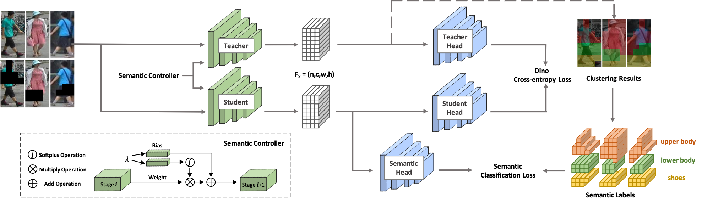

<div align="center"></div>


[](https://paperswithcode.com/sota/pedestrian-attribute-recognition-on-pa-100k?p=beyond-appearance-a-semantic-controllable)
[](https://paperswithcode.com/sota/person-re-identification-on-msmt17?p=beyond-appearance-a-semantic-controllable)
[](https://paperswithcode.com/sota/person-re-identification-on-market-1501?p=beyond-appearance-a-semantic-controllable)
[](https://paperswithcode.com/sota/person-search-on-cuhk-sysu?p=beyond-appearance-a-semantic-controllable)
[](https://paperswithcode.com/sota/person-search-on-prw?p=beyond-appearance-a-semantic-controllable)
[](https://paperswithcode.com/sota/pedestrian-detection-on-citypersons?p=beyond-appearance-a-semantic-controllable)
[](https://paperswithcode.com/sota/semantic-segmentation-on-lip-val?p=beyond-appearance-a-semantic-controllable)
[](https://paperswithcode.com/sota/pose-estimation-on-coco?p=beyond-appearance-a-semantic-controllable)

Welcome to **SOLIDER**! SOLIDER is a Semantic Controllable Self-Supervised Learning Framework to learn general human representations from massive unlabeled human images which can benefit downstream human-centric tasks to the maximum extent. Unlike the existing self-supervised learning methods, prior knowledge from human images is utilized in SOLIDER to build pseudo semantic labels and import more semantic information into the learned representation. Meanwhile, different downstream tasks always require different ratios of semantic information and appearance information, and a single learned representation cannot fit for all requirements. To solve this problem, SOLIDER introduces a conditional network with a semantic controller, which can fit different needs of downstream tasks. For more details, please refer to our paper [Beyond Appearance: a Semantic Controllable Self-Supervised Learning Framework for Human-Centric Visual Tasks](https://arxiv.org/abs/2303.17602).

<div align="center"></div>

## Updates
- **[2023/03/28: Codes of 3 downstream tasks are released!] **
    * Training details of our pretrained model on 3 downstream human visual tasks, including person re-identification, person search and pedestrian detection, are released.
- **[2023/03/13: SOLIDER is accepted by CVPR2023!]**
    * The paper of SOLIDER is accepted by CVPR2023, and its offical pytorch implementation is released in this repo. 

## Installation
This codebase has been developed with python version 3.7, PyTorch version 1.7.1, CUDA 10.1 and torchvision 0.8.2.                                           

## Datasets
Download **LUPerson** from its [offical link](https://github.com/DengpanFu/LUPerson-NL/tree/main/LUP-NL) and unzip it.                                                               

## Training
- Choice 1. To train SOLIDER from scratch, please run:
```shell
sh run_solider.sh
```

- Choice 2. Training SOLIDER from scratch may take a long time. To speed up the training, you can train a DINO model first, and then finetune it with SOLIDER, as follows:
```shell
sh run_dino.sh
sh resume_solider.sh
```

## Finetuning and Inference
There is a demo to run the trained SOLIDER model, which can be embedded into the inference or the downstream task finetuning.
```shell
python demo.py
```

## Models
| Task | Dataset | Swin Tiny<br>([Link](https://drive.google.com/file/d/12UyPVFmjoMVpQLHN07tNh4liHUmyDqg8/view?usp=share_link)) | Swin Small<br>([Link](https://drive.google.com/file/d/1oyEgASqDHc7YUPsQUMxuo2kBZyi2Tzfv/view?usp=share_link)) | Swin Base<br>([Link](https://drive.google.com/file/d/1uh7tO34tMf73MJfFqyFEGx42UBktTbZU/view?usp=share_link)) |
| :---: |:---: |:---: | :---: | :---: |
| Person Re-identification (mAP/R1)<br>w/o re-ranking | Market1501 | 91.6/96.1 | 93.3/96.6 | 93.9/96.9 |
|  | MSMT17 | 67.4/85.9 | 76.9/90.8 | 77.1/90.7 |
| Person Re-identification (mAP/R1)<br>with re-ranking | Market1501 | 95.3/96.6 | 95.4/96.4 | 95.6/96.7 |
|  | MSMT17 | 81.5/89.2 | 86.5/91.7 | 86.5/91.7 |
| Attribute Recognition (mA) | PETA_ZS | 74.37 | 76.21 | 76.43 |
|  | RAP_ZS | 74.23 | 76.84 | 77.96 |
|  | PA100K | 84.14 | 86.25 | 86.37 |
| Person Search (mAP/R1) | CUHK-SYSU | 94.9/95.7 | 95.5/95.8 | 94.9/95.5 |
|  | PRW | 56.8/86.8 | 59.8/86.7 | 59.7/86.8 |
| Pedestrian Detection (MR-2) | CityPersons | 10.3/40.8 | 10.0/39.2 | 9.7/39.4 |
| Human Parsing (mIOU) | LIP | 57.52 | 60.21 | 60.50 |
| Pose Estimation (AP/AR) | COCO | 74.4/79.6 | 76.3/81.3 | 76.6/81.5 |

- All the models are trained on the whole LUPerson dataset.

## Traning codes on Downstream Tasks
- [Person Re-identification](https://github.com/tinyvision/SOLIDER-REID)
- [Person Search](https://github.com/tinyvision/SOLIDER-PersonSearch)
- [Pedestrian Detection](https://github.com/tinyvision/SOLIDER-PedestrianDetection)
- Human Attributes
- Human Parsing
- Pose Estimation

## Acknowledgement
Our implementation is mainly based on the following codebases. We gratefully thank the authors for their wonderful works.
- [DINO](https://github.com/facebookresearch/dino)
- [TransReID](https://github.com/damo-cv/TransReID)
- [TransReID-SSL](https://github.com/damo-cv/TransReID-SSL)
- [SeqNet](https://github.com/serend1p1ty/SeqNet)
- [Pedestron](https://github.com/hasanirtiza/Pedestron)

## Reference
If you use SOLIDER in your research, please cite our work by using the following BibTeX entry:
```
@inproceedings{chen2023beyond,
  title={Beyond Appearance: a Semantic Controllable Self-Supervised Learning Framework for Human-Centric Visual Tasks},
  author={Weihua Chen and Xianzhe Xu and Jian Jia and Hao Luo and Yaohua Wang and Fan Wang and Rong Jin and Xiuyu Sun},
  booktitle={The IEEE/CVF Conference on Computer Vision and Pattern Recognition},
  year={2023},
}
